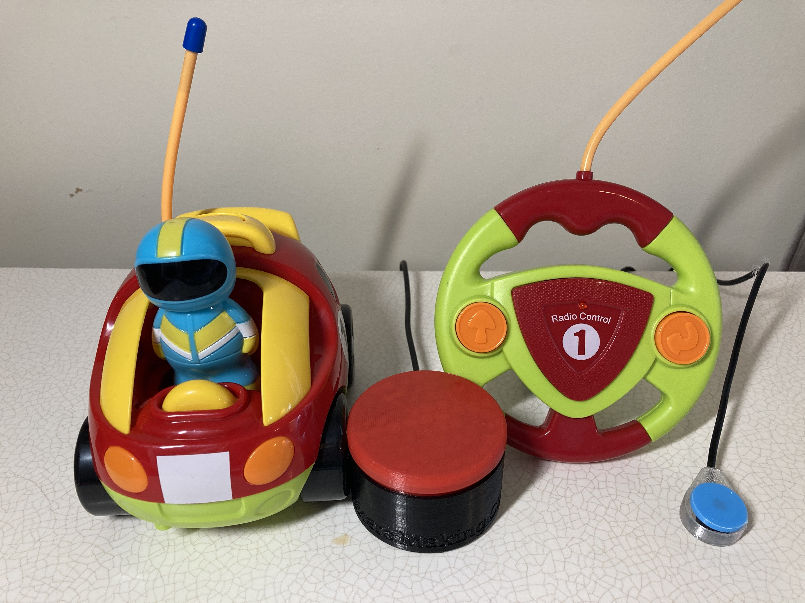

# Switch Adapted Remote Controlled Car
The Switch Adapted Remote Controlled Car is a colourful cartoon remote controlled car that has been switch adapted so it can be controlled with two 3.5 mm assistive switches. This adaptation is intended for users that have difficulty activating the small buttons on the remote.

To use the Switch Adapted Remote Controlled Car, plug in two assistive switches with 3.5 mm plugs to the two 3.5 mm jacks on the remote. One switch will make the car go forwards and the other will make the car reverse and turn.

## More info at
- [Makers Making Change Project Page](https://makersmakingchange.com/project/switch-adapted-rc-car-toy/ )

## How to Obtain a Switch Adapted Remote Controlled Car
### 1. Do it Yourself (DIY) or Do it Together (DIT)

This is an open-source assistive technology, so anyone is free to build it. All of the files and instructions required to build the Switch Adapted Remote Controlled Car are contained within this repository. Refer to the Maker Checklist below.

### 2. Request a build of this device

If you would like to obtain a Switch Adapted Remote Controlled Car, you may submit a build request through the [MMC Library Page](https://makersmakingchange.com/project/switch-adapted-rc-car-toy/). The requestor is responsible for the cost of materials and any shipping.

### 3. How to build this device for someone else

If you have the skills and equipment to build this device, and would like to donate your time to adapt a toy for someone who needs it, visit the [MMC Maker Wanted](https://makersmakingchange.com/maker-wanted/) section.

## Getting Started

### 1. Read the Makers Checklist

The Makers Checklist outlines all the steps 

### 2. Order the Off-The-Shelf Components

The [Bill of Materials](/Documentation/RC_Car_BOM_v1.0.xlsx) lists all of the parts and components required to build the Switch Adapted Remote Controlled Car. The main remote controlled car toy needs to be ordered online. The rest of the off-the-shelf components are also online or may be available in smaller quantities at your local hardware store or dollar store.

### 3. Assemble the Switch Adapted Remote Controlled Car

Reference the [Assembly Guide](/Documentation/RC_Car_Assembly_Guide_v1.0.pdf) for the tools and steps required to adapt this toy.

## Files
### Documentation
| Document             | Version | Link |
|----------------------|---------|------|
| Design Rationale     | 1.0     | [RC_Car_Design_Rationale](/Documentation/RC_Car_Design_Rationale_v1.0.pdf)     |
| Maker Checklist      | 1.0     | [RC_Car_Maker_Checklist](/Documentation/RC_Car_Maker_Checklist_v1.0.pdf)     |
| Bill of Materials    | 1.0     | [RC_Car_Bill_of_Materials](/Documentation/RC_Car_BOM_v1.0.xlsx)     |
| Assembly Guide       | 1.0     | [RC_Car_Assembly_Guide](/Documentation/RC_Car_Assembly_Guide_v1.0.pdf)     |
| User Guide           | 1.0     | [RC_Car_User_Guide](/Documentation/RC_Car_User_Guide_v1.0.pdf)    |
| Changelog            | 1.0     | [RC_Car_Changelog](/Documentation/RC_Car_Changelog_v1.0.pdf)     |

## Attribution
Modification method and documentation created by Neil Squire / Makers Making Change.

## License
Everything needed or used to design, make, test, or prepare the Switch Adapted Remote Controlled Car is licensed under the CERN 2.0 Permissive license <https://ohwr.org/project/cernohl/wikis/Documents/CERN-OHL-version-2> (CERN-OHL-P) . 

Accompanying material such as instruction manuals, videos, and other copyrightable works that are useful but not necessary to design, make, test, or prepare the Switch Adapted Remote Controlled Car are published under a Creative Commons Attribution-ShareAlike 4.0 license https://creativecommons.org/licenses/by-sa/4.0/ (CC BY-SA 4.0).

---

## About Makers Making Change

Makers Making Change is an initiative of [Neil Squire](https://www.neilsquire.ca/), a Canadian non-profit that helps people with disabilities.

We are committed to creating a network of volunteer makers who support people with disabilities in their communities through 3D printing assistive devices. Check out our library of free, open-source assistive technologies with parts and build instructions.

 - Website: [www.MakersMakingChange.com](https://www.makersmakingchange.com/)
 - GitHub: [https://github.com/makersmakingchange](https://github.com/makersmakingchange)
 - Twitter: [@makermakechange](https://twitter.com/makermakechange)
 - Instagram: [@makersmakingchange](https://www.instagram.com/makersmakingchange)

## Contact Us

For technical questions, to get involved, or share your experience we encourage you to visit the [MMC Website](https://www.makersmakingchange.com/), [MMC Forum](https://makersmakingchange.com/forum), or contact info@makersmakingchange.com
